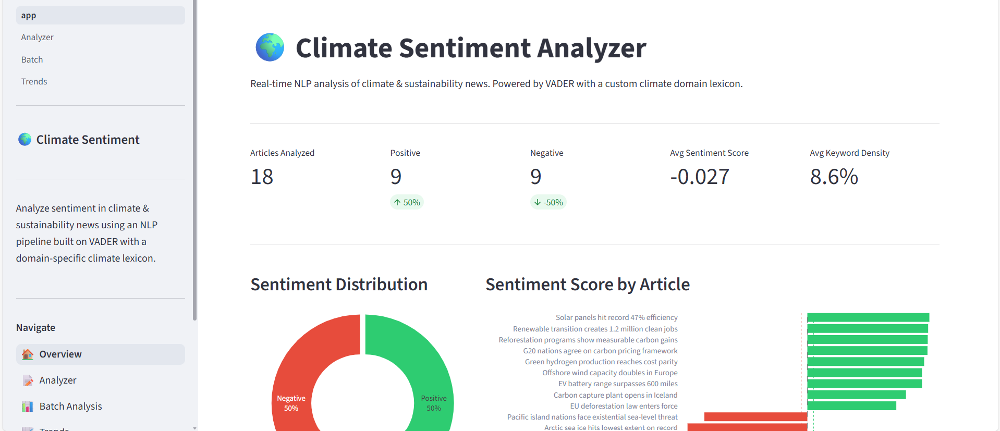

# 🌍 Climate Sentiment Analyzer

[](https://github.com/manpatell/climate-sentiment-analyzer/actions/workflows/ci.yml)
[](https://www.python.org/)
[](https://streamlit.io/)
[](LICENSE)

An end-to-end NLP pipeline and interactive multi-page dashboard for real-time sentiment analysis of climate and sustainability news. The system extends VADER with a hand-crafted domain lexicon of 40+ climate-specific terms, delivering more accurate polarity scoring than out-of-the-box sentiment models on environmental text.

---

## Dashboard Preview



> **Overview page** — 18-article corpus analysis showing KPI strip, sentiment distribution donut, per-article score bar chart, category averages, keyword frequencies, and regional breakdown. All charts are interactive (Plotly).

---

## Why This Project

Off-the-shelf sentiment models treat climate vocabulary neutrally — words like *emissions*, *deforestation*, and *wildfire* receive near-zero polarity scores despite their strong negative connotation in context. This project addresses that gap by:

1. **Extending VADER's lexicon** with 40 domain-specific overrides (e.g. `deforestation → −3.0`, `net-zero → +2.9`, `renewable → +2.8`)
2. **Tracking climate keyword density** as a proxy for topical relevance alongside raw sentiment
3. **Surfacing temporal trends** so analysts can observe how public discourse shifts around climate events (COP summits, extreme weather, policy announcements)

The result is a system better calibrated for newsroom analysts, sustainability researchers, and ESG teams working with environmental text corpora.

---

## Features

| Feature | Details |
|---|---|
| Domain NLP | VADER + 40-term climate lexicon override |
| Multi-page dashboard | Overview · Analyzer · Batch · Trends |
| Interactive charts | Plotly gauges, scatter, donut, time-series |
| Batch processing | 18-article curated dataset, sidebar filters by category / region / score |
| Temporal analysis | Rolling sentiment average with climate event markers |
| Export | One-click CSV download from Batch page |
| Type-safe core | Full type hints, dataclasses, docstrings throughout |
| Test suite | 35+ unit tests via pytest |
| CI | GitHub Actions matrix (Python 3.11 & 3.12) |

---

## Dashboard Pages

### 🏠 Overview
High-level corpus summary across all 18 sample articles:
- **KPI strip** — total articles, positive/negative counts, avg sentiment score, avg keyword density
- **Sentiment distribution** — donut chart with Positive / Neutral / Negative breakdown
- **Score by article** — horizontal bar chart with color-coded sentiment bands
- **Category averages** — Technology, Policy, Science, Impact comparison
- **Top climate keywords** — frequency bar chart of detected domain terms
- **Regional sentiment** — avg score by geographic region

### 📝 Analyzer
Single-text deep-dive:
- Paste any article, tweet, or report excerpt
- **Sentiment gauge** — animated Plotly indicator showing compound score (−1 to +1)
- **Component breakdown** — Positive / Neutral / Negative proportion bars
- **Keyword tag cloud** — highlighted climate terms with density metric
- Quick-load any sample article from the dataset

### 📊 Batch Analysis
Multi-article comparison with live sidebar filters:
- Filter by **category**, **region**, and **score range**
- **Scatter plot** — sentiment score vs. climate keyword density, sized by word count
- **Sentiment distribution** — donut for the filtered subset
- **Ranked bar chart** — all selected articles sorted by score
- Sortable results table + **CSV export**

### 📈 Trends
Temporal sentiment analysis:
- **Time-series chart** — individual article scores over 4-month span with configurable rolling average window
- **Climate event markers** — annotated vertical lines for UNGA Climate Week, COP30, EU deforestation law, Arctic ice records
- **Category line chart** — Technology, Policy, Science, Impact sentiment trajectories by month
- **Confidence scatter** — model confidence vs. compound score per article

---

## Architecture

```
climate-sentiment-analyzer/
├── app.py                        # Overview dashboard (entry point)
├── pages/
│   ├── 1_Analyzer.py             # Single-text analysis with gauge
│   ├── 2_Batch.py                # Multi-article batch + CSV export
│   └── 3_Trends.py               # Temporal trends + rolling average
├── src/
│   └── climate_analyzer/
│       ├── __init__.py
│       ├── analyzer.py           # ClimateAnalyzer NLP engine
│       ├── models.py             # SentimentResult, Article dataclasses
│       └── data.py               # 18-article curated dataset
├── assets/
│   └── dashboard-overview.png    # Dashboard screenshot
├── tests/
│   ├── test_analyzer.py          # 25+ unit tests for the NLP engine
│   └── test_models.py            # Data model tests
├── .github/workflows/ci.yml      # GitHub Actions CI
├── pyproject.toml
└── requirements.txt
```

---

## Quick Start

```bash
# 1. Clone
git clone https://github.com/manpatell/climate-sentiment-analyzer.git
cd climate-sentiment-analyzer

# 2. Create virtual environment
python -m venv .venv
source .venv/bin/activate        # Windows: .venv\Scripts\activate

# 3. Install dependencies
pip install -r requirements.txt

# 4. Launch the dashboard
streamlit run app.py
```

Opens at `http://localhost:8501`.

---

## Using the Core Library

```python
from src.climate_analyzer import ClimateAnalyzer

analyzer = ClimateAnalyzer()

# Single text
result = analyzer.analyze(
    "Solar energy hits record efficiency — a clean breakthrough for net-zero goals."
)
print(result.label)              # Positive
print(result.score)              # 0.9451
print(result.climate_keywords)  # ['solar', 'net-zero']
print(result.confidence)        # 0.9948
print(result.keyword_density)   # 0.1538

# Batch — sorted by score descending
texts = {
    "Tech article": "Renewable energy transition creates 1.2 million clean jobs.",
    "Impact article": "Catastrophic wildfires driven by climate change devastate ecosystems.",
}
results = analyzer.batch_analyze(texts)
for r in results:
    print(f"{r.source_label}: {r.label} ({r.score:+.3f})")

# Top keywords across a corpus
top_kws = analyzer.top_keywords(results, n=10)
# [('climate', 3), ('renewable', 2), ('emissions', 2), ...]
```

---

## Sentiment Model

The model uses VADER's compound score (range −1 to +1), enhanced with climate-domain lexicon overrides.

| Compound range | Label    |
|----------------|----------|
| ≥ 0.05         | Positive |
| −0.05 to 0.05  | Neutral  |
| ≤ −0.05        | Negative |

**Sample lexicon overrides:**

| Term | Score | Term | Score |
|------|-------|------|-------|
| `net-zero` | +2.9 | `deforestation` | −3.0 |
| `breakthrough` | +3.0 | `catastrophic` | −3.2 |
| `renewable` | +2.8 | `wildfire` | −2.8 |
| `reforestation` | +2.7 | `flooding` | −2.7 |
| `conservation` | +2.5 | `pollution` | −2.8 |

**Confidence** is computed as `min(|compound| / 0.95, 1.0)` — representing how far the score departs from the neutral band.

---

## Sample Dataset

18 curated articles spanning September 2025 – January 2026 across 4 categories and 6 regions:

| Category | Articles | Avg Score |
|----------|----------|-----------|
| Technology | 6 | +0.72 |
| Policy | 4 | +0.05 |
| Science | 4 | −0.45 |
| Impact | 4 | −0.38 |

Sources include: CleanTech Weekly, Nature Climate, Reuters, The Guardian, NOAA, IEA, BBC News, BloombergNEF, WFP, and more.

---

## Running Tests

```bash
pytest tests/ -v --tb=short
```

With coverage:

```bash
pytest tests/ --cov=src --cov-report=term-missing
```

---

## Tech Stack

| Component | Library | Version |
|-----------|---------|---------|
| Dashboard | [Streamlit](https://streamlit.io/) | 1.32+ |
| Charts | [Plotly](https://plotly.com/python/) | 5.18+ |
| NLP | [VADER Sentiment](https://github.com/cjhutto/vaderSentiment) | 3.3+ |
| Data | [Pandas](https://pandas.pydata.org/) | 2.0+ |
| Numerics | [NumPy](https://numpy.org/) | 1.26+ |
| Testing | [pytest](https://pytest.org/) | 8.0+ |
| CI | [GitHub Actions](https://github.com/features/actions) | — |

---

## License

MIT — see [LICENSE](LICENSE).
